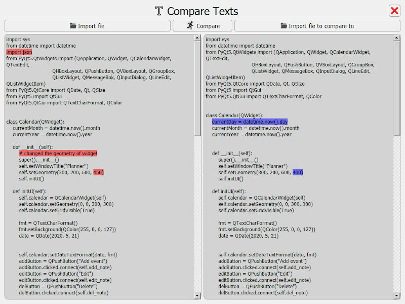

# App Info
* PyQt5 app to compare two texts
* Shows changes made to the files with red/blue background color
* Can import any text based format, or copy the text into the boxes

# Shortcuts
* Ctrl+E to import left file, Ctrl+T to import right file
* Ctrl+R to run the comparison

# Sample screen

